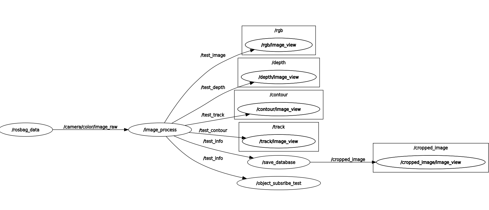
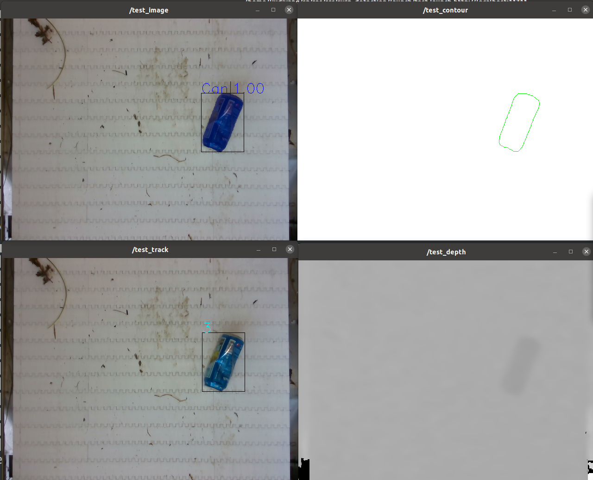

# **Refined trash sorting with moving conveyor belts**

This is the semester thesis deriving from the [ARC](https://riverclean.ethz.ch/) project. The whole project is composed of two parts. The first part is to train neural network to detect multiple sorts of trash collected from water. To improve the classifier detector, novel network architecture *[Swin Transformer](https://github.com/microsoft/Swin-Transformer)* has been introduced.

The second part focuses on extracting information from the detected object. Basic structure is realized by python on ROS.

.gif)


## Training Swin Transformer

The training procedure is based on [MMDetection](https://github.com/open-mmlab/mmdetection) developed and maintained by senseTime. This platform integrates plenty of open source algorithms for object detection that could be simply tuned for future adjustment.

#### Dependencies

```
Ubuntu 20.04.3 LTS
Nvidia Driver: 470.57.02    
CUDA: 11.4
python:3.7.11 
pytorch: 1.8.1
mmcv :1.3.15
mmdet:2.17.0

Nvidia GeForce GTX 2080
```


#### Environment Setup

```bash
Prerequisite:
-CUDA 9.2+
-GCC  5+

```

##### Step 1.Install prerequisite(skip this if they are already installed)

[CUDA reference](https://developer.nvidia.com/cuda-downloads?target_os=Linux&target_arch=x86_64&Distribution=Ubuntu&target_version=20.04&target_type=deb_local)(select preferable version [here](https://developer.nvidia.com/cuda-toolkit-archive))

```
# install CUDA ,take latest version as example 

wget https://developer.download.nvidia.com/compute/cuda/repos/ubuntu2004/x86_64/cuda-ubuntu2004.pin

sudo mv cuda-ubuntu2004.pin /etc/apt/preferences.d/cuda-repository-pin-600

wget https://developer.download.nvidia.com/compute/cuda/11.6.0/local_installers/cuda-repo-ubuntu2004-11-6-local_11.6.0-510.39.01-1_amd64.deb

sudo dpkg -i cuda-repo-ubuntu2004-11-6-local_11.6.0-510.39.01-1_amd64.deb

sudo apt-key add /var/cuda-repo-ubuntu2004-11-6-local/7fa2af80.pub

sudo apt-get updatesudo apt-get -y install cuda

```


```
# install GCC
sudo apt update
sudo apt install build-essential
sudo apt-get install manpages-dev
```


##### Step 2. Install MMDetection

Official document [here](https://mmdetection.readthedocs.io/en/v2.20.0/get_started.html)

```
#1.Create a conda virtual environment and activate it.

conda create -n openmmlab python=3.7 -y
conda activate openmmlab

#2.Install PyTorch and torchvision of suitable version,e.g.

conda install pytorch=1.3.1 cudatoolkit=9.2 torchvision=0.4.2 -c pytorch

#3.Install MMDetection

pip install openmim
mim install mmdet

#or
# install the latest mmcv

pip install mmcv-full -f https://download.openmmlab.com/mmcv/dist/cu101/torch1.6.0/index.html

# install mmdetection

git clone https://github.com/open-mmlab/mmdetection.git
cd mmdetection
pip install -r requirements/build.txt
pip install -v -e .
```

 

#### Dataset

TACO+TrashNet+Experiment Raw Image

- [TACO](http://tacodataset.org/)
- [TrashNet](https://github.com/garythung/trashnet)
- Experiment


#### Data Preprocess

- `remap_classes.py` 

  reads annotaions (`.json` files) and class remap (`.csv` file) and outputs new annotation files

  ` python remap_classes.py --class_map maps/map_to_2.csv --ann_dir ./data/annotations.json `

- `merge.py`

  merge two coco-format annotation files

  `python merge.py Json1.json Json2.json OUTPU_JSON.json`

- `fix_category.py`

  fix the category list order to be consistent with trained neural network

- `split_dataset.py`

  takes an annotations file (`.json`) and splits it into training, testing, validation datasets for x many equivalent sets for cross validation.

  ` python split_dataset.py --nr_trials 5 --out_name ann_05 --dataset_dir data`

- `change_subdirectory.py`

  change the subdirectory name in the annotations file.

  `python change_subdirectory.py --input new_directory --original annotations.json --new output.json`

- `add_subdirectory.py`

  add subdirectory into the annotation file.

- `filter.py`

  select interested categories from the original annotation file,e.g.

  `python filter.py --input_json instances_train2017.json --output_json filtered.json --categories person dog cat`


#### Training

[official training tutorial link](https://mmdetection.readthedocs.io/en/latest/2_new_data_model.html)

There is no official support for the cross validation algorithm. If you want to train with 5-fold method, use `bash ./train4.sh` and change the work-dir in the bash file.


##### configuration of annotations

`model` : adjust the roi_head number consistent with the classes you declare

`data` : specify the train and validation and test data file here

`classes`: categories for detection


#### Labeling tools

[Segment.ai](https://segments.ai/)

[LabelMe](https://github.com/wkentaro/labelme)

[EISeg](https://github.com/PaddleCV-SIG/EISeg)

[COCO-annotator](https://github.com/jsbroks/coco-annotator)

Note: After labeling, check the correspondence between classes in `config` and `annotations`file.

## Extracting object information

This is the ROS implementation of the object detection system.  The whole node structure is as follows.



Once the detector has been launched, the basic information of the object including annotation details and tracking ID will be extracted and saved for future retraining and database statistics.

The example visualization of output is like the following picture.



#### Prerequisite

Install ROS noetic. [Tutorial](http://wiki.ros.org/ROS/Installation)


#### Quick Start

`conda activate openmmlab`

`catkin_make`

`roslaunch swin_detection launch.launch`


Note: if there is any package not existed, just install ros packages according to the log under openmmlab environment.


#### Output

`/output_database`:cropped images and corresponding `.json` file 

`/output_multi`:images and `annotations_multi.json`

`/output`:single object annotation that is used for debugging


#### Files Breakdown

`/scripts`

`image_info.py` : Define classes for annotation extracting

`sort.py`: Tracker based on Kalman filter to keep tracking bounding box

`image_process_node.py`: Core node to deploy the neural network and save multiple object annotation details

`object_info_subsribe_node.py`: Helping node to extract single object information for verification and debugging

`database_save_node.py`: Obtain cropped image for every object and save information for database


`/launch`

`launch.launch`:launch above nodes and specify the rosbag data path here.


`/msg`

`Object.msg` : Customize object message to convey extracted information for sequential nodes


`/config`

`parameters.yaml`: load parameters for the detection system

